<h1> Technical Skills and Certifications </h1>

Make sure to click the arrow tabs to see my completion and progression of Technical Skills and Certifications.

<h2> Technical Skills </h2>

Github Learning Lab

  
  
  <h4> Description: </h4>
  I have completed the introductory First Day and Week on <a href="https://lab.github.com/courses">GitHub Learning Lab.</a> The following topics helped me to understand fundamental tools such as merges, pull requests, and how to collaborate with others on multiple projects easily. Github is used my many people to share, edit, and assist pieces of codes, projects, and systems. This technical resume is managed with a personal repository that is used with Github too!
  
 <h4>Courses: </h4>
 <ul>
 <li>Introduction to GitHub: Closing an Issue, Creating Branches, and Merging Pull Requests </li>
 <li>Communicating using Markdown: Adding Headers, Images, and Lists </li>
 <li>Uploading projects to GitHub: Learning the basics of preparing uploads/projects </li>
 <li>GitHub Pages Knowledge: Customizing homepage and site details</li>
 <li>Pull Request Functionalities: Fundamentals for creating and reviewing pull requests.</li>
 <li>Managing Merge Conflicts: Creating and resolving conflicts</li>
 <li>Securing workflows: Updating Dependency versions and finding Vulnerable Dependencies</li>
 </ul>
 <h4> Proof of Course Accomplishment: </h4>
  
 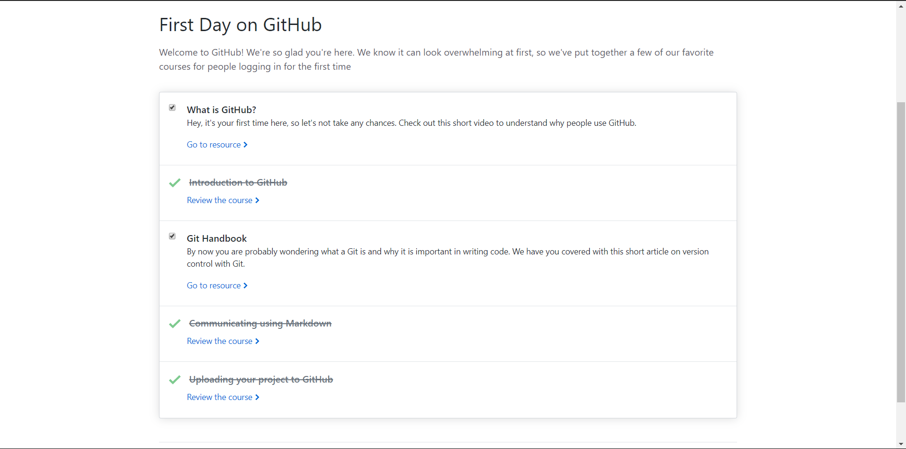
  
 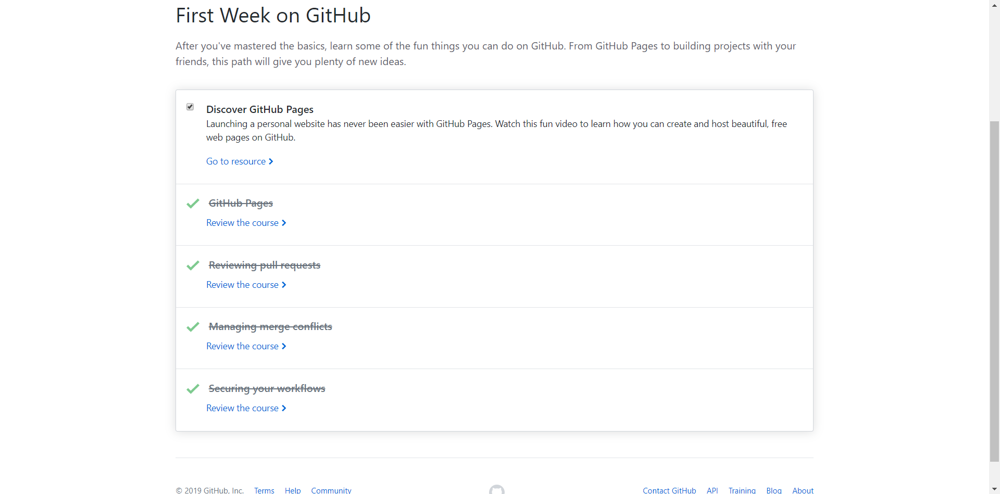
  
 

  
  

PowerBI

  
  
  <h4> Description: </h4>
  I have taken and completed the labs, exercises, and videos for Microsoft's PowerBI at edX's training courses <a href="https://www.edx.org/course/analyzing-visualizing-data-power-bi-4">Analyzing and Visualzing Data with PowerBI</a> These courses included learning how to import various data types, contruct and modify dashboards, and interpret and manipulate data for different visualizations. The following modules have taught me how to intepret various data types and the ability to optimize multiple visualizations on a dashboard or published report.

<h4>Courses:</h4> 
<ul>
<li>Power BI Desktop Data Transformations: Merging Queries, Entering Data, and Splitting Columns</li>
<li>Power BI Desktop Modelling: Managing Data Relationships and Creating Hierarchies</li>
<li>Power BI Desktop Visualization: Using different Visualizations and Filters</li>
<li>Power BI Service: Understanding Dashboards and Sharing Data</li>
<li>Working with Excel: Pinning Worksheets and Analyzing Them</li>
<li>Direct Connectivity: Using SSAS Connetor and HANA</li>
<li>Developer API: Using Custom Visuals and Others Applications</li>
<li>Mobile App: Functionality with Mobile Layout</li>
</ul>
<h4> Proof of Completion: </h4>
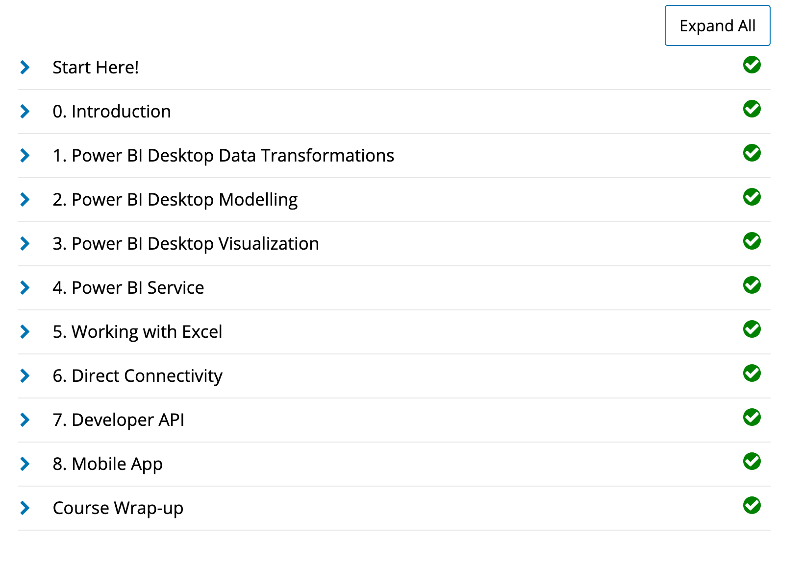

Power BI Dashboard

  
  
<h4> Description: </h4>
A requirement for my Emergent Tech Skills class included the ability to complete and design a dashboard from the <a href="https://docs.microsoft.com/en-us/power-bi/sample-supplier-quality">Supplier Quality Analysis sample</a> provided by Microsoft. Clicking the following link will provide you a video demostration of my dashboard: <a href="https://youtu.be/-NOagJzF1gU">Supplier Quality Analysis Dashboard.</a>  Having the tools to be able to create a visualization with important information is one of the most valuble assets about using Power BI!
 
 
  The following is a shared link to my PowerBI dashboard for public viewing:
<a href="https://app.powerbi.com/view?r=eyJrIjoiODJiMWFjOWItM2JhYi00MTAzLWFmNGYtYTUwZjI1ODgwZjIzIiwidCI6ImQ0ZmYwMTNjLTYyYjctNDE2Ny05MjRmLTViZDkzZTgyMDJkMyIsImMiOjN9">Supplier Quality Analysis</a>
 
 
  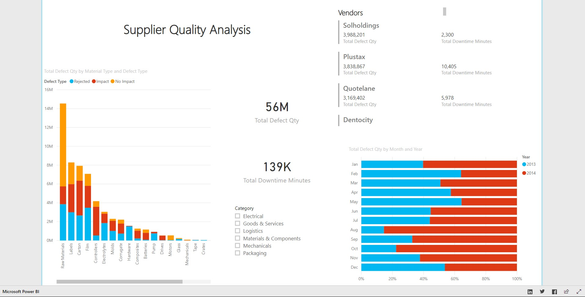

Linux

<h4> Description: </h4>
  I have taken and completed the course for LPI Linux Essentials at <a href="https://linuxacademy.com">Linux Academy.</a> These courses included an introduction to Linux as an operating system, Linux Kernal, command line syntax, and the overall capabilities of Linux. After taking this course, I have become more familiar with the functionality and current applications that use Linux. The ability to use this to make a system secure with permissions and ownership displays the security benefits with understanding Linux!
  
  <h4><a href="https://linuxacademy.com/cp/modules/view/id/346?redirect_uri=https://app.linuxacademy.com/search?query=linux%20essentials">Course Topics:</a></h4>
<ul>
<li>Linux Evolution and Popular Operating Systems</li>
<li>Major Open Source Applications</li>  
<li>ICT Skills and Working in Linux</li>
<li>Using Directories and Listing Files</li> 
<li>The Linux Operating System</li>
<li>Security and File Permissions</li>
<li>Basic Security and Identifying User Groups</li>
<li>Managing File Permissions and Ownership</li> 
<li>Special Directories and Files</li> 
</ul>

<h4> LPI Linux Essentials Course Completion Certificate: </h4>
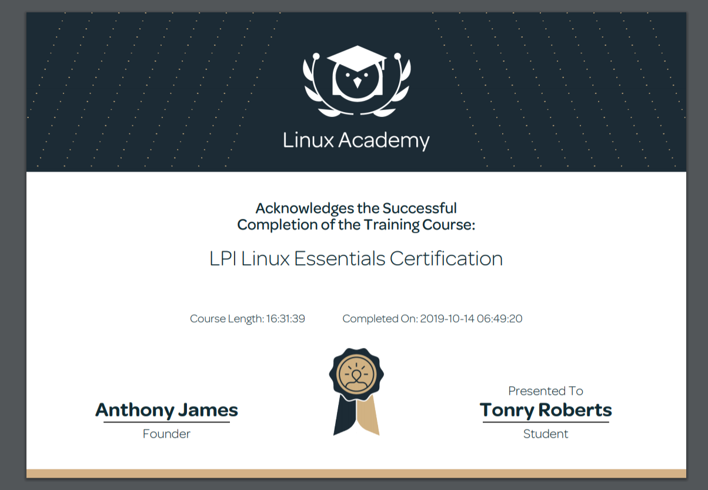
 
 
With the completion of the Linux Essentials course, I was able to install Virtual Box and Ubuntu from this <a href="https://sal-a.github.io/vbox-ubuntu/#2-download-an-iso-file-for-ubuntu-from-httpsubuntucomdownloaddesktop">installation guide</a> to deploy an Algo VPN IPSec server installation and operational test with these <a href="https://github.com/trailofbits/algo">setup instructions</a> that utilized Digital Ocean. The subsequent screenshot helps showcase the successful host IP address, AlgoVPN IP address, and DigitalOcean droplet:
 
 
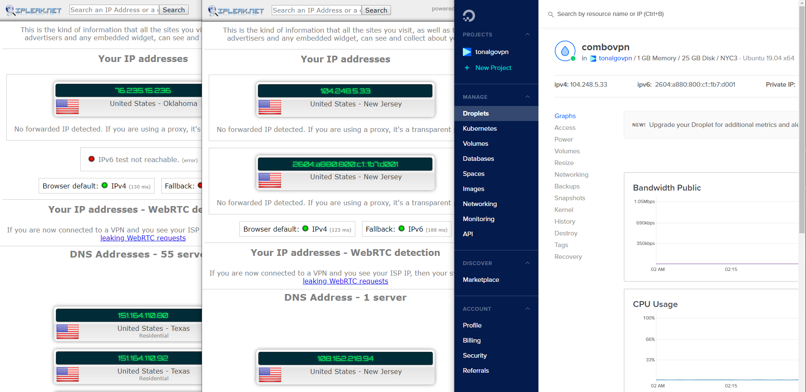

AWS

  
  
  <h4> Description: </h4>
  With the completion of the Amazon Web Services Essentials course on <a href="https://linuxacademy.com">Linux Academy,</a> I was able to be introduced to the core of AWS services and the ability of applying the following concepts to real-world applications. Additonally, I learned how to setup my personal AWS account, understand management tools, and how AWS uses its platform to manage databases, storage services, and elastic cloud computations. AWS has become beneficial for organizations to stay ahead or keep up with new resources and capabilities.
  
  <h4><a href="https://linuxacademy.com/cp/modules/view/id/241?redirect_uri=https://app.linuxacademy.com/search?query=w&categories=AWS&type=Course">Course Topics:</a></h4>
  <ul>
<li>Managing AWS Access with Users, Groups, and Roles</li>
<li>Networking Services and Connectivity</li>  
<li>Compute Services</li>
<li>Storage Services</li> 
<li>Database Services</li>
<li>Monitoring, Alerts, and Notifications</li>
<li>Load Balancing, Elasticity, and Scalability</li>
<li>Serverless Compute</li>  
</ul>
  
<h4> AWS Essentials Course Completion Certificate: </h4>
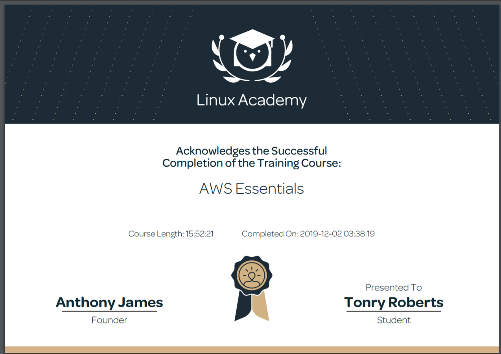
 
 
After completing the AWS Essentials course, I configured an additonal Virtual Private Network with an OpenVPN Access Server that would be on AWS. I followed this <a href="https://openvpn.net/vpn-server-resources/amazon-web-services-ec2-byol-appliance-quick-start-guide/">installation guide</a> which included the launch and configuration steps to deploy the OpenVPN Access Server on EC2 within AWS. The following screenshot helps showcase my accomplished OpenVPN Access Server launch with my current EC2 instance and Active Configuration:
 
 
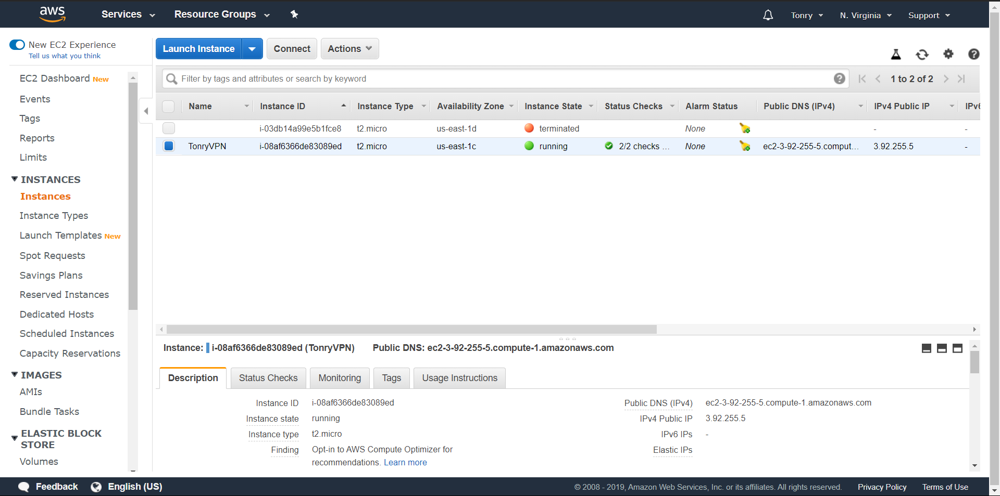
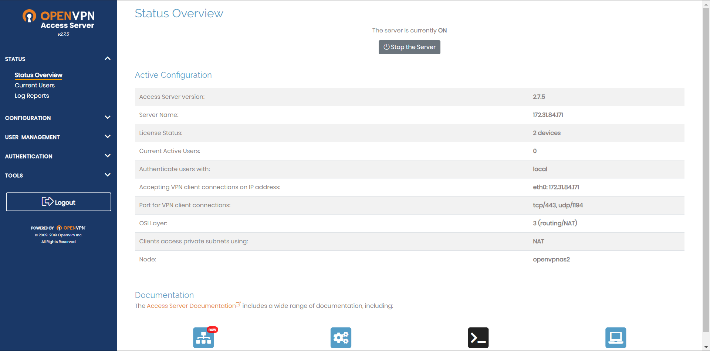

PowerShell

  
  
  <h4> Description: </h4>
  With the completion of the PowerShell 5 Essential Training provided by <a href="https://www.linkedin.com/learning/powershell-5-essential-training/welcome">LinkedIn,</a> I was introduced to the basics of PowerShell 5 and the capabilities you can access and work within the Windows operating system. For example, I was able to learn and grasp the automation security, scripting, and integrated scripting environment (ISE) topics for a better understanding of scripting and automation in Windows PowerShell. This course also included content about understanding how to utilize cmdlets with administator access and the useful assistance of help commands for syntax, csv and xml file exports and imports, and script writing in the ISE.
  
  <h4><a href="https://www.linkedin.com/learning/powershell-5-essential-training/welcome">Course Topics:</a></h4>
  <ul>
<li>Getting Ready for PowerShell</li>
<li>Discovery and Getting Help</li>  
<li>Extending Your Capabilities with PowerShell</li>
<li>Using the Power of the Pipeline</li> 
<li>Database Services</li>
<li>Getting More out of Objects</li>
<li>Scripts and Automation</li>
<li>Scalable Management with PowerShell Remoting</li>  
</ul>
  
 <h4> PowerShell 5 Essential Course Completion Certificate: </h4>
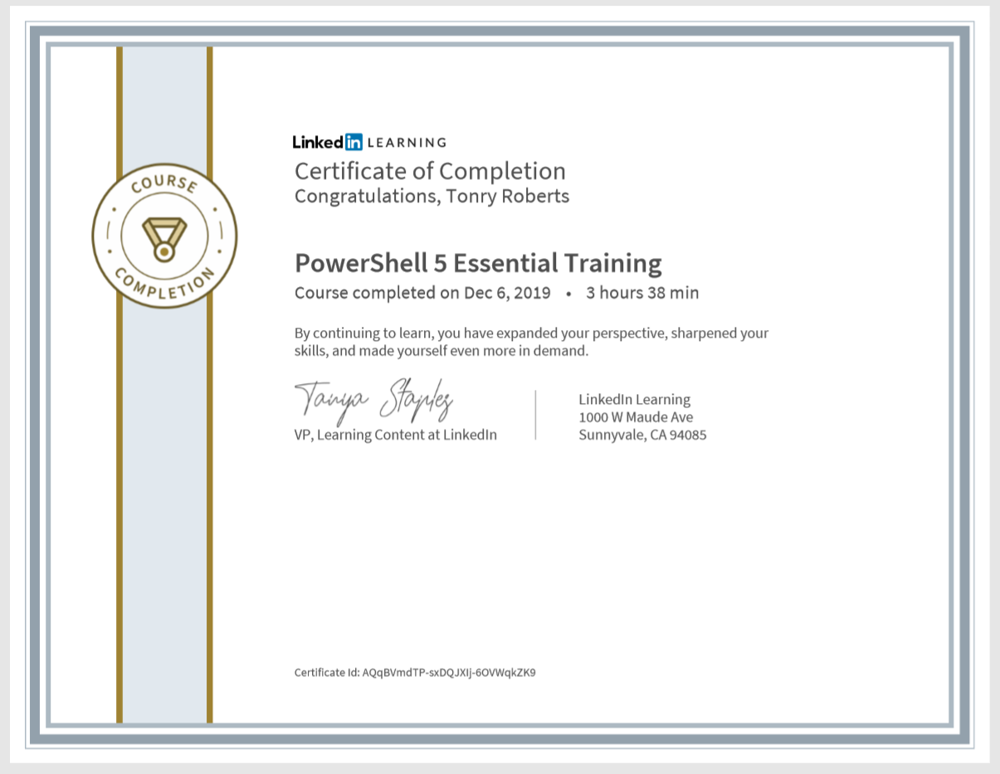

SalesForce

  
  
  <h4> Description: </h4>
  With the completion of the Salesforce Admin Beginner Course provided by <a href="https://trailhead.salesforce.com/en/content/learn/trails/force_com_admin_beginner">Trailhead,</a> I was introduced to the basics and utilities in Salesforce. As I was progressing through this course, I learned how to create reports with filters, create objects, fields and relationships, export and import data from different sources, and the ability to provide and create unique visualizations that can be made for many key business aspects. Being exposed and introduced to these topics and steps helped me understand the capabilities cloud technology can have on businesses and indivduals too!
  
<h4><a href="https://trailhead.salesforce.com/en/content/learn/trails/force_com_admin_beginner">Course Topics:</a></h4>
  <ul>
<li>Salesforce Platform Basics</li>
<li>Data Modeling</li>  
<li>Data Management</li>
<li>Lightning Experience Customization</li> 
<li>Salesforce Mobile App Customization</li>
<li>User Engagement</li>
<li>Reports & Dashboards for Lightning Experience</li> 
</ul>

 <h4> Salesforce Admin Beginner Course Completion & Badges: </h4>
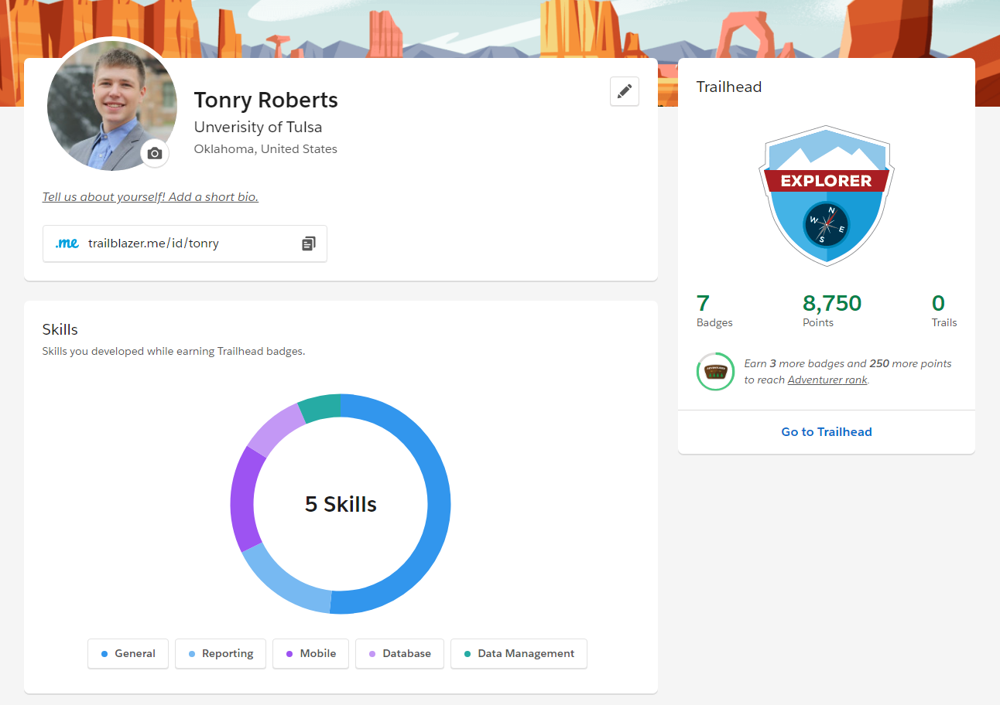
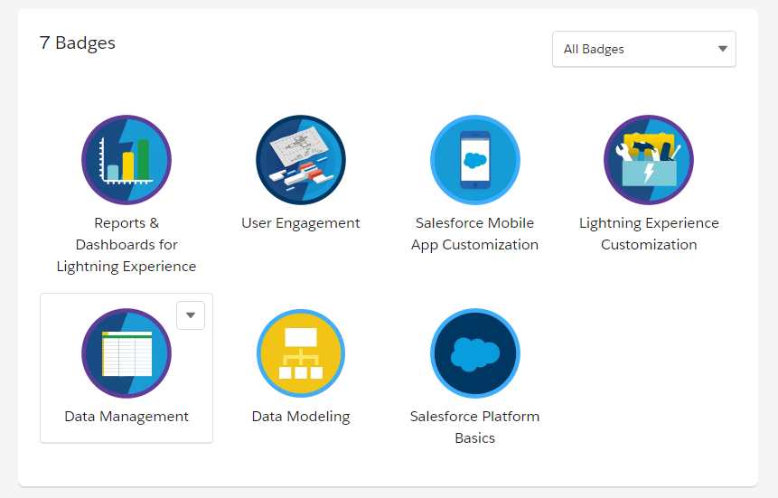

